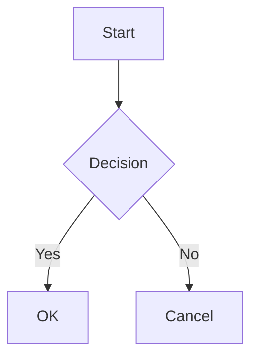

# Heading 1
## Heading 2
### Heading 3
#### Heading 4

Basic Lists:
- First item
- Second item
  - Nested item level 1
    - Nested item level 2
  * Alternative bullet style
- Third item

Numbered Lists:
1. First numbered item
2. Second numbered item
   1. Nested numbered item
   2. Another nested item
3. Third numbered item

Text Links:
[Visit our website](https://example.com)
[Complex URL with underscores](https://example.com/path_with_underscore)

Images:


*Image caption example*

Image with link:
[](https://example.com)

Tables:
| Header 1 | Header 2 | Header 3 |
| -------- | -------- | -------- |
| Cell 1   | Cell 2   | Cell 3   |
| Row 2    | Data     | More     |

Code Blocks:
```javascript
const testFunction = () => {
  console.log("Testing code block");
  return true;
};
```

Code block with filename:
```javascript:test.js
const namedFunction = () => {
  console.log("Testing named code block");
};
```

Diff syntax highlighting:
```diff javascript
- const oldVersion = "deprecated";
+ const newVersion = "updated";
  const unchanged = "stays the same";
```

Math Equations:
Inline math: $E = mc^2$

Block math:
$$
\sum_{i=1}^{n} x_i = \frac{n(n+1)}{2}
$$

Blockquotes:
> This is a blockquote
> It can span multiple lines
>> Nested blockquotes are possible

Footnotes:
Here's a sentence with a footnote[^1].
Here's an inline footnote^[This is the inline footnote content].

[^1]: This is the footnote content.

Horizontal Rules:
---

Inline Styles:
*This is italic text*
**This is bold text**
~~This is strikethrough text~~
`This is inline code`

<!-- This is a hidden comment -->

Custom Message Blocks:
:::message
This is a standard message block
:::

:::message alert
This is an alert message block
:::

Collapsible Content:
:::details Click to expand
This content is hidden by default
:::

::::details Nested elements example
:::message
This is a nested message inside a collapsible section
:::
::::

Diagrams:


Content Embeds:
@[card](https://example.com/article)
@[tweet](https://twitter.com/username/status/123456789)
@[youtube](https://www.youtube.com/watch?v=dQw4w9WgXcQ)
@[gist](https://gist.github.com/username/abc123)
@[codepen](https://codepen.io/username/pen/abc123)
@[slideshare](slide-key-123)
@[speakerdeck](deck-id-456)
@[figma](https://www.figma.com/file/abc123)

URL-only line for auto card:
https://example.com/article

GitHub file embed:
https://github.com/username/repo/blob/main/README.md#L1-L3

Test UTF-8 Characters:
Hello, 世界! 👋 🌎 ⭐️